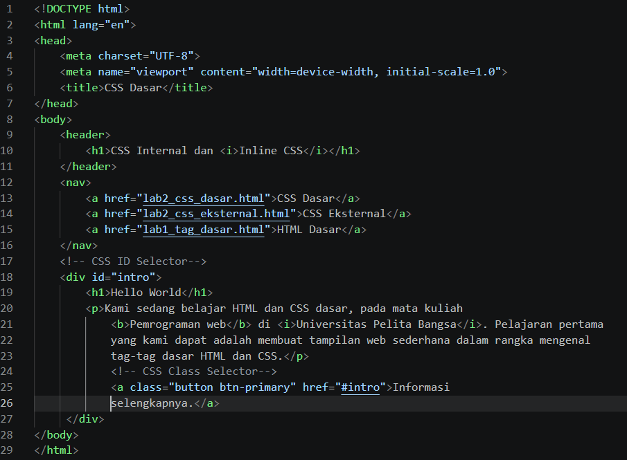
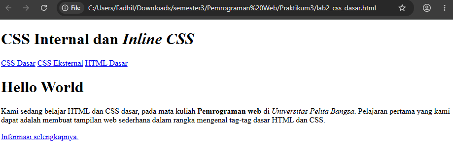
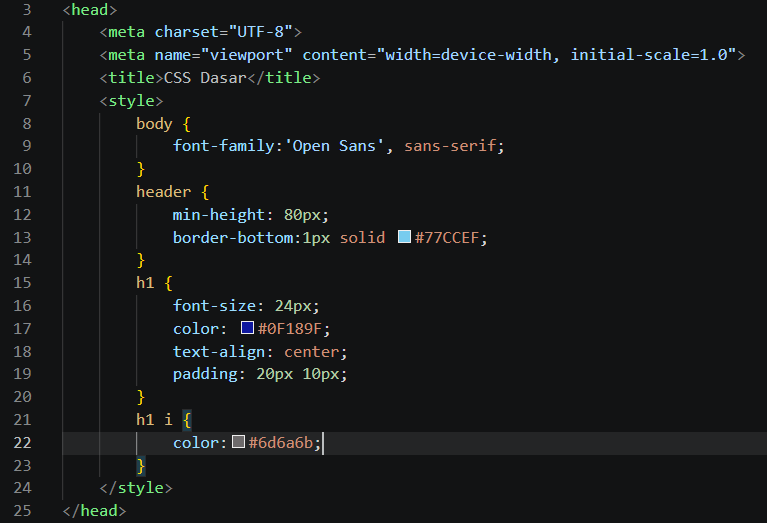
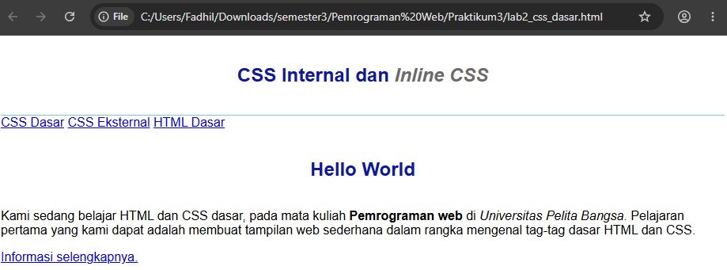
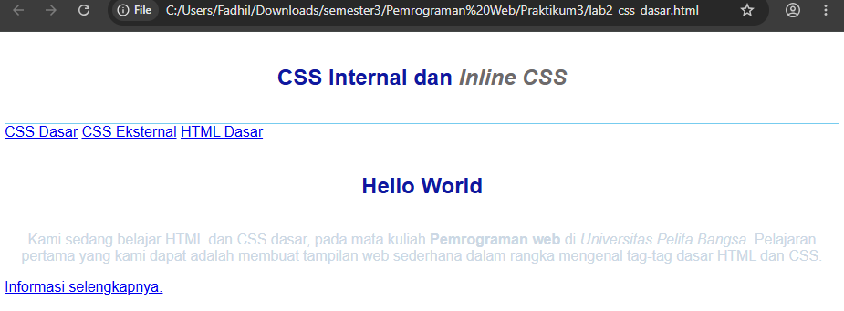
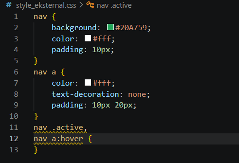
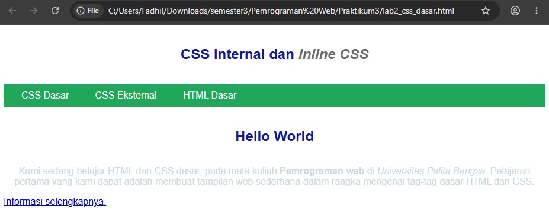
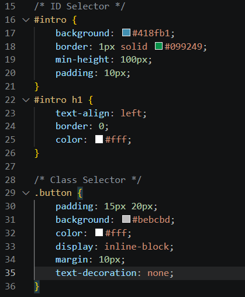
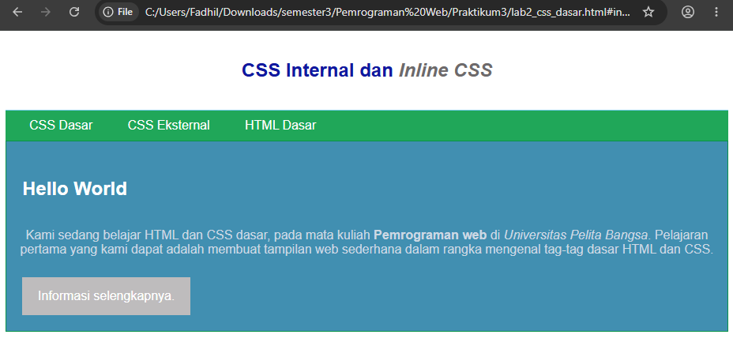

# PRAKTIKUM 3 - CSS DASAR  

## Nama: Fadhil Syafiq Abdullah  
## NIM: 312510161  
## Mata Kuliah: Pemrograman Web  

### Langkah1 - Membuat Dokumen HTML 

Pada langkah pertama, dibuat sebuah dokumen HTML dengan nama lab2_css_dasar.html. Dokumen tersebut menggunakan struktur dasar HTML yang terdiri dari <!DOCTYPE html>, <html>, <head>, dan <body>. Pada bagian body dibuat header, navigasi, serta bagian informasi yang berisi heading, paragraf, dan tombol menggunakan elemen HTML. Langkah ini bertujuan untuk membuat struktur halaman web yang nantinya akan diberikan pengaturan menggunakan CSS. 

code: 

 

Gambar di atas menunjukkan kode HTML dasar yang digunakan untuk membuat struktur halaman web. Pada bagian tersebut terdapat header, navigasi, heading, paragraf, serta link yang nantinya akan digunakan sebagai dasar untuk penerapan CSS. 

Output: 

 

Gambar di atas menunjukkan kode HTML dasar yang digunakan untuk membuat struktur halaman web. Pada bagian tersebut terdapat header, navigasi, heading, paragraf, serta link yang nantinya akan digunakan sebagai dasar untuk penerapan CSS. 

### Langkah 2 - Mendeklarasikan CSS Internal

Pada langkah kedua, ditambahkan CSS secara internal ke dalam dokumen HTML. CSS internal dituliskan menggunakan tag <style> yang ditempatkan pada bagian <head>. Beberapa pengaturan yang diberikan meliputi jenis font pada halaman, ukuran dan warna heading, posisi teks heading, serta garis pembatas pada bagian header. Dengan CSS internal, tampilan halaman HTML dapat dibuat lebih teratur dan menarik tanpa membuat file CSS terpisah. 

Code: 

 

Gambar di atas menunjukkan deklarasi CSS internal yang ditulis di dalam tag <style>. CSS tersebut digunakan untuk mengatur tampilan body, header, h1, dan elemen <i> yang berada di dalam heading. 

Output: 

 

Gambar output menunjukkan perubahan tampilan halaman setelah CSS internal diterapkan. Font halaman, ukuran heading, warna heading, posisi teks, dan tampilan header berubah sesuai dengan aturan CSS yang telah dibuat. 

### Langkah 3 - Menambahkan Inline CSS

Pada langkah ketiga, ditambahkan CSS secara inline pada elemen HTML. Inline CSS dituliskan langsung pada tag HTML menggunakan atribut style. Pada praktikum ini, inline CSS digunakan untuk memberikan pengaturan tertentu pada elemen paragraf. Cara ini memungkinkan pengaturan CSS diterapkan secara langsung pada elemen yang dipilih. 

Code: 

Gambar di atas menunjukkan penerapan inline CSS pada elemen HTML menggunakan atribut style. Properti CSS dituliskan langsung di dalam tag sehingga pengaturan tersebut hanya diterapkan pada elemen yang diberikan atribut tersebut. 

Output: 

 

Gambar output menunjukkan perubahan pada elemen yang diberikan inline CSS. Tampilan elemen tersebut berubah sesuai dengan properti dan nilai CSS yang dituliskan secara langsung pada tag HTML. 

### Langkah4 - Membuat CSS Eksternal

Pada langkah keempat, dibuat file CSS eksternal dengan nama style_eksternal.css. CSS ditulis pada file terpisah dari dokumen HTML sehingga pengaturan tampilan dapat dikelola melalui file CSS tersebut. Setelah file CSS dibuat, file tersebut dihubungkan dengan dokumen HTML menggunakan tag <link> pada bagian <head>. Dengan cara ini, aturan CSS dari file eksternal dapat diterapkan pada halaman HTML. 

Code: 

 

Gambar di atas menunjukkan pembuatan file style_eksternal.css yang berisi deklarasi CSS untuk mengatur tampilan halaman web. 

 

Gambar di atas menunjukkan penggunaan tag <link> pada bagian <head> untuk menghubungkan dokumen HTML dengan file CSS eksternal style_eksternal.css. 

Output: 

 

Gambar output menunjukkan tampilan halaman setelah CSS eksternal berhasil dihubungkan dengan dokumen HTML. Perubahan tampilan yang berasal dari file style_eksternal.css sudah diterapkan pada halaman web.#mary. Selector tersebut digunakan untuk menentukan elemen HTML mana yang akan diberikan aturan CSS tertentu. 

Code: 

 

Gambar di atas menunjukkan penggunaan CSS ID Selector dan Class Selector. ID Selector #intro digunakan untuk mengatur bagian tertentu pada halaman, sedangkan Class Selector .button dan .btn-primary digunakan untuk memberikan pengaturan tampilan pada elemen yang menggunakan class tersebut. 

Output: 

 

Gambar output menunjukkan hasil akhir halaman setelah ID Selector dan Class Selector diterapkan. Bagian intro mendapatkan pengaturan tampilan tersendiri, sedangkan tombol mendapatkan tampilan berdasarkan class yang digunakan. 